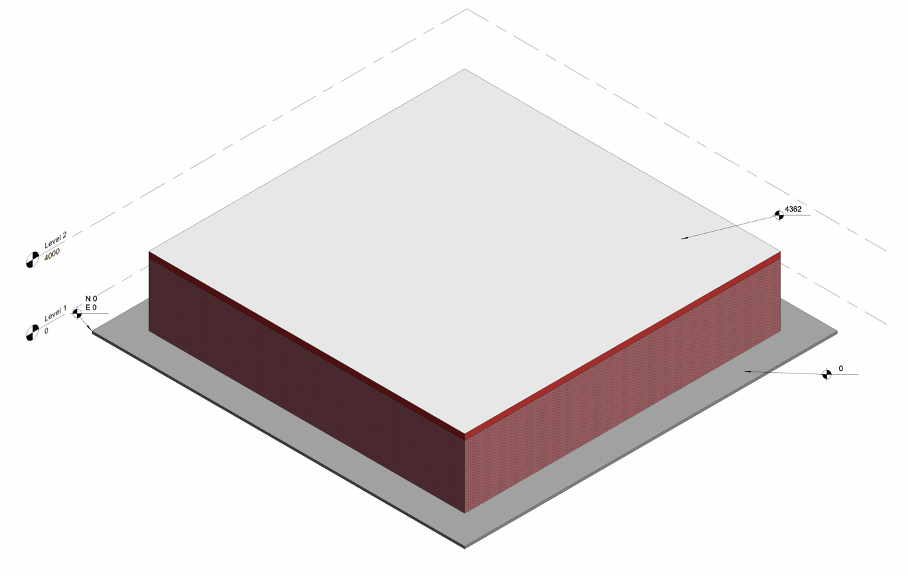
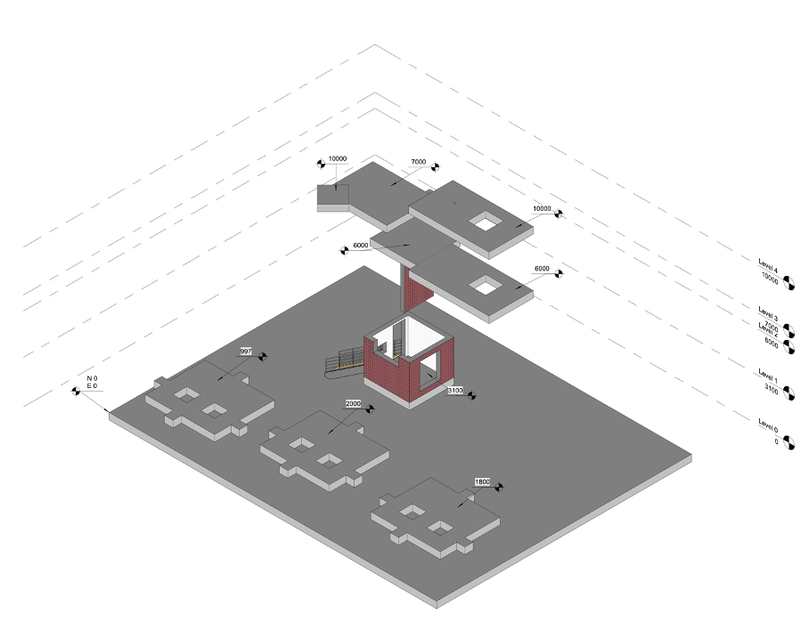

# BIM-Based3DBenchmark
This Repository contains the Benchmark model A and B for automated performance assessment of automated construction safety planning approaches. Additionally it contains the Workshop document, that has been used to create the ground truth assessments, that is used in the automated assessment application [Automated Assessment Application](https://kakke14-assessmentgui-0--welcome-w3jlfn.streamlit.app/). 

## Benchmark model A 
The low complexity benchmark model, which is a minimum viable solution assessment. The model consists of only a ground plane placed at elevation 0, 4 walls, each 4 meters high, and a slab on top. This situation clearly contains one hazardous platform that needs to be protected. This model allows us to clearly understand how the domain experts are assessing the model, capturing the ground truth, and should not lead to any ambiguity.

## Benchmark model B
the benchmark model that has been carefully designed to include edge-case scenarios of the regulations that have been investigated for this work. Specifically, it consists of the two parts. The first part in front of the stamped line in Figure 11 is designed such that the first platform’s elevation (fd) is below the threshold for the European and US regulations, the second platform’s elevation (fd) is high enough to be subject to the EU and US regulation, and the third platform’s elevation is subject to only the US regulation. Additionally, the platforms have been designed with smaller outgoing platforms, whose widths (ws) are chosen to be subject to individual regulations. Lastly, the platforms include two openings, one bigger than the allowable coverable dimensions (cw and ch) stated for the US regulation, i.e., the larger opening requires guardrails, and the other smaller opening requires a covering. This dimension is not stated for the EU regulation and will be subject to best practices in the ground truth assessment by the domain experts. The other part of the model (behind the stamped line) is designed to capture special cases such as openings in walls and slabs, leading edges, coverable gabs, tumbling spaces, leading edges that are non-orthogonal to the model space, and obstacles in the movement space where the domain experts also must use their best practices.

